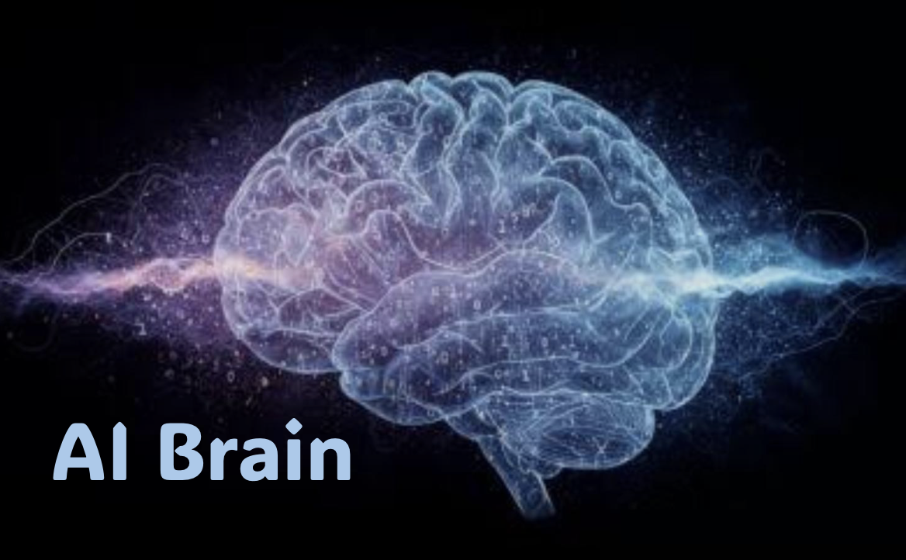

--------------------------------------------------------------------------------

# AI-Brain — Helper and Maintenance Utility for AI-Brains

`ai-brain` is a small `bash`-based CLI that turns any directory tree into a
context-aware knowledge base for an AI assistant (currently
[Claude Code](https://docs.claude.com/en/docs/claude-code)). Knowledge is
organized hierarchically; only what lies on the path from the current working
directory to the filesystem root is activated — *passend und ausreichend,
ohne Überschuss*.


## Curl Installation Formula

In a `bash` shell with installed `curl` execute the following one-line command
to download and install `ai-brain`. Select a number from the list of potential
install directories (which are extracted from your PATH).

```sh
  HUB=https://raw.githubusercontent.com/aibex-hub; \
      curl -s $HUB/tool-ai-brain/ihux/bin/ai-brain >~ai-brain; bash ~ai-brain -!
```


## Background — The Adäquanz Hypothesis (Tutorial)

The conceptual foundation behind AI-Brain is the *Adäquanz hypothesis* — both
too little and too much context degrade the quality of AI responses. A four-part
tutorial (in German), prefaced by a short teaser, walks through the reasoning
and the practical realization:

0. [**Teaser und Wegweiser**](./docs/00-tutorial-teaser.md) — why bother reading the four parts (5 min)
1. [**Halluzination und Adäquanz**](./docs/01-halluzination-und-adaequanz.md) — the underlying problem and the Adäquanz hypothesis
2. [**AI-Brain — Idee einer KI-Architektur**](./docs/02-ai-brain-idee.md) — hierarchical knowledge tree with path-activated context
3. [**Aufbau und Aktivierung (vereinfacht)**](./docs/03-aufbau-und-aktivierung.md) — two simple file-system conventions (`§` for roots, `@` for masterspaces)
4. [**Installation Schritt für Schritt**](./docs/04-installation.md) — from empty directory to running system on your own machine

Parts 1–3 are conceptual reading (~25 min); part 4 is hands-on and overlaps with
the Quick Start below.


## Pre-Requisites

Pre-requisites for `ai-brain` are a `bash` environment (as supported by Linux,
Mac-OS and Windows/WSL), [Claude Code](https://docs.claude.com/en/docs/claude-code)
installed and authenticated, and two helper tools:

* `ec` — the color-echo helper from the Bluccino toolchain, hosted at
  [bluccino/tool-ec](https://github.com/bluccino/tool-ec) (used for all coloured output)
* `jq` — JSON command-line processor (used by `--setup`/`--cleanup` to surgically
  merge the hook into `~/.claude/settings.json` without disturbing other keys)

Availability of `tree` is helpful for following the tutorial (it lets you see
the directory structure you build) but not absolutely necessary. With `curl`
installed the section above shows an easy way to download and install
`ai-brain`. Alternatively, cloning the repository and copying `bin/ai-brain` to
a binary directory listed in `$PATH` will also do the job (`ai-brain` is
located in the repository's subfolder `bin`).

```sh
    $ git clone https://github.com/aibex-hub/tool-ai-brain  # see tool-ai-brain/bin/ai-brain
```

Tool `ai-brain` provides a dependency self-check and a version self-check:

```sh
  $ ai-brain --check       # verify all required dependencies are installed
  $ ai-brain --version     # print version
```


## What Is an AI-Brain?

An **AI-Brain** is a directory hierarchy that lets you organize personal or
project-specific context for an AI assistant without bloating every query with
the full body of knowledge. The hierarchy follows two simple conventions:

* The **root** of an AI-Brain is a directory whose name starts with `§` — for
  example `§Privat/` or `§AIbex/`.
* Any directory inside the root may carry an `@/` subfolder (the **masterspace**)
  containing `.md` files with context that should be activated whenever you work
  in or below that directory.

When a query is sent from inside an AI-Brain, a hook script (registered by
`ai-brain --setup`) walks up from the current working directory to the
filesystem root, collects every `@/`-folder along that path, and prepends
their `.md` contents to the query as additional context. Branches outside the
active path stay inactive.

The result is **path-activated context**: precisely what is relevant to the
current task, nothing more.

~~~
    NOTE: The theoretical motivation for path-activated context is the
    "Adäquanz-Hypothese": both too little and too much context degrade the
    quality of AI responses. AI-Brain operationalizes that hypothesis by
    making the active context a function of the current working directory.
~~~


## Quick Start

After installation, run the embedded step-by-step tutorial to set up a working
example AI-Brain in a couple of minutes:

```sh
  $ ai-brain --tutorial
```

The tutorial walks you through:

1. creating the example directory tree
2. inspecting it with `tree -a`
3. populating three masterspaces with example content (recipes and electronics
   as two unrelated topics)
4. re-inspecting the populated tree
5. installing the hook with `ai-brain --setup`
6. running a first probe query inside Claude Code
7. verifying the activation (direct hook probe + side-branch comparison)
8. (optional) removing the hook again with `ai-brain --cleanup`

All commands inside the tutorial are presented as copy-paste-ready bash
blocks.


## Commands

```
ai-brain --setup      # install hook into ~/.claude/settings.json (global)
ai-brain --cleanup    # remove the hook from ~/.claude/settings.json
ai-brain --context    # print masterspace context along cwd path
ai-brain --tutorial   # step-by-step setup walkthrough
ai-brain --help       # comprehensive help
ai-brain --version    # print version
ai-brain --check      # verify required dependencies are installed
ai-brain -!           # install ai-brain into a PATH directory
ai-brain -?           # brief usage
```

`ai-brain --setup` wires `ai-brain --context` into Claude Code's
`UserPromptSubmit` hook by **merging** it into your global
`~/.claude/settings.json` via `jq`. Other top-level keys in that file
(e.g. `"theme"`, other hook types) are preserved; the operation is
idempotent — running `--setup` twice does not register the hook twice.
`--cleanup` performs the inverse and likewise leaves unrelated settings
intact.

Because the hook is registered globally, `ai-brain --context` runs for **every**
Claude Code invocation; the walk-up logic ensures it exits silently with no
output when the current working directory has no `§`-prefixed ancestor with
an `@/` masterspace.

See `ai-brain --help` for full per-command descriptions.


## Conventions

| Pattern         | Meaning                                                |
|-----------------|--------------------------------------------------------|
| `§<name>/`      | AI-Brain root                                          |
| `@/`            | masterspace (context files, recursively)               |


## License

Apache License 2.0 — see [LICENSE](./LICENSE).


## Appendix: Claude Code in a Bash Shell

`ai-brain` runs as a small bash CLI and assumes you can reach a working `bash`
prompt with the `claude` command available on it. This appendix shows how to
get there on macOS, Linux, and Windows.

### macOS

1. Open `Terminal.app` or `iTerm2`.
2. Install Node.js 18+ — easiest via [Homebrew](https://brew.sh):
   ```sh
   brew install node
   ```
3. Install Claude Code:
   ```sh
   npm install -g @anthropic-ai/claude-code
   ```
4. Run `claude`. The first invocation triggers a browser-based OAuth flow
   against your Anthropic account.

Alternative install methods (Homebrew formula, native installer) are
documented at the [Claude Code docs](https://docs.claude.com/en/docs/claude-code).

### Linux

1. Open your terminal emulator (gnome-terminal, konsole, alacritty, …).
2. Install Node.js 18+ for your distro:
   - Ubuntu / Debian: `sudo apt install nodejs npm`
   - Fedora:          `sudo dnf install nodejs npm`
   - Arch:            `sudo pacman -S nodejs npm`
3. Install Claude Code:
   ```sh
   npm install -g @anthropic-ai/claude-code
   ```
4. Run `claude` and authenticate via the browser flow.

If your distro ships an older Node.js, install the current LTS from
[nodesource.com](https://github.com/nodesource/distributions).

### Windows

Native Windows (`cmd`, PowerShell) is **not** supported by `ai-brain`,
because the script relies on bash, `find`, and POSIX path semantics. The
supported path is **WSL** (Windows Subsystem for Linux):

1. Install WSL — open PowerShell as Administrator and run:
   ```powershell
   wsl --install
   ```
   This installs WSL plus the default Ubuntu distribution.
2. After the prompted restart, open the **Ubuntu** entry from the Start
   menu — you're now in a bash shell inside Linux.
3. Inside WSL, install Node.js and Claude Code:
   ```sh
   sudo apt update && sudo apt install -y nodejs npm
   npm install -g @anthropic-ai/claude-code
   ```
4. Run `claude` and authenticate via browser.

From now on do all `ai-brain`-related work inside the WSL terminal —
including the curl install at the top of this README. Files you create
live under `~/` in the WSL filesystem and are reachable from Windows
Explorer at `\\wsl$\Ubuntu\home\<your-user>`.

---

Once `claude` starts in your bash shell, go back to the
[Curl Installation Formula](#curl-installation-formula) at the top to
install `ai-brain` itself.
