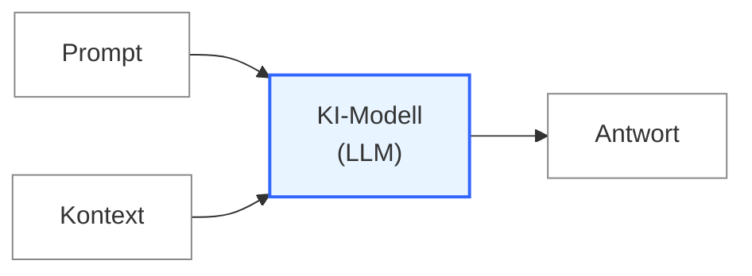

# Teil 1 — Halluzination und Adäquanz

**Datum:** 2026-05-15
**Status:** Tutorial-Teil (1 von 4) — didaktischer Einstieg
**Lernziel:** Der Leser erkennt, dass es nicht immer die beste Strategie ist, alles verfügbare Wissen in den Kontext einer KI-Anfrage zu packen — und versteht die Adäquanz-Hypothese als handhabbare Antwort auf diese Beobachtung.

## Vorspann — Wie eine KI-Anfrage aufgebaut ist

Bevor wir über das eigentliche Problem sprechen, klären wir kurz, wie eine Anfrage an ein modernes KI-System eigentlich aussieht.

Jedes **KI-System** (wie ChatGPT, Claude und Verwandte) enthält als Herz ein **KI-Modell** — in der Fachsprache auch *Large Language Model* (kurz **LLM**) genannt. Das KI-Modell ist die eigentliche Maschinerie, die Anfragen verarbeitet und Antworten erzeugt. Das KI-System drumherum kümmert sich um alles andere: die Benutzeroberfläche, die Auswahl und Steuerung des Modells und — für uns am wichtigsten — die Zusammenstellung des Kontexts.

Jede Anfrage an das KI-Modell besteht aus **zwei Teilen**:

- **Prompt** — die eigentliche Frage oder Aufgabe, die der Anwender stellt
- **Kontext** — das Hintergrundwissen, das dem Modell zusätzlich mitgegeben wird, damit es die Frage gut beantworten kann

Das KI-Modell verarbeitet beide Teile zusammen und liefert eine **Antwort** zurück:

Was viele nicht sofort sehen: **das KI-System entscheidet, was als Kontext mitgegeben wird** — nicht das KI-Modell selbst. Der Kontext ist also nichts, was das Modell "von allein hat" — er muss vom KI-System bewusst zusammengestellt werden. Welche Dokumente, welche Regeln, welche Beispiele, welche Vorgaben — all das ist eine Design-Entscheidung des KI-Systems.

Genau hier setzt das Tutorial an. Wir fragen: *Was ist eigentlich ein guter Kontext für eine KI-Anfrage?*

## Das Problem — Halluzinationen

Wer mit modernen KI-Systemen arbeitet, kennt das Phänomen: Manchmal antwortet das System **selbstbewusst und ausführlich**, aber inhaltlich **schlicht falsch**. Es zitiert Quellen, die es nicht gibt. Es schreibt API-Funktionen aus, die nie existiert haben. Es liefert Statistiken, die frei erfunden sind.

Diese Erfindungen heißen in der Fachsprache **Halluzinationen**. Sie sind eines der größten ungelösten Probleme aktueller KI-Systeme.

Halluzinationen haben mehrere Ursachen. Eine davon — und genau die wollen wir hier verstehen — hat mit dem **Kontext** zu tun, den das KI-Modell bei der Anfrage zur Verfügung gestellt bekommt.

## Eine intuitive Vermutung

Stellen wir uns den Kontext wie das Hintergrundmaterial vor, das ein Mensch beim Bearbeiten einer Aufgabe vor sich liegen hat. Zwei Extreme:

- **Zu wenig Hintergrundmaterial** — die wichtigsten Fakten fehlen, der Bearbeiter muss raten oder erfinden. Antworten werden lückenhaft oder falsch.

- **Zu viel Hintergrundmaterial** — der Schreibtisch quillt über, das Wesentliche geht im Rauschen unter. Der Bearbeiter findet die relevanten Stellen nicht mehr und greift zu Plausiblem statt zu Korrektem.

Beides führt zu schlechten Ergebnissen. Es liegt nahe zu vermuten, dass es bei LLMs ähnlich ist: weder zu sparsam noch zu üppig ist gut. Es muss einen **passenden Mittelweg** geben.

## Mizzis Volksweisheit

Die oberösterreichische Mizzi hat diesen Mittelweg schon vor langer Zeit auf einen Satz gebracht:

> *"Z'weng und z'vü is's Narren-Zü."*
>
> *(Zu wenig und zu viel ist des Narren Ziel.)*

Die Pointe sitzt im Reim und im Inhalt zugleich: **beide** Extreme — *zu wenig* UND *zu viel* — werden als Narrenziel bezeichnet. Der Kluge sucht den Mittelweg implizit.

Auf unseren Fall übertragen heißt das: Wer einem LLM zu wenig Kontext gibt, narrt es zur Wissenslücke. Wer ihm zu viel gibt, narrt es zur Verwirrung. Das *Narren-Zü* ist nicht ein Punkt, sondern alles, was nicht *gerade richtig* ist.

## Formalisierung — die Adäquanz-Hypothese

Was Mizzi in einem Spruch zusammenfasst, lässt sich auch in technischer Sprache formulieren. Wir nennen das die **Adäquanz-Hypothese**:

> *Für eine gegebene Anfrage an ein LLM gibt es einen günstigen Bereich von Kontext-Eigenschaften, der die Antwortqualität maximiert. Sowohl zu sparsamer Kontext (Wissenslücke) als auch zu üppiger Kontext (Verwirrung) führen zu schlechteren Antworten. Die Beziehung zwischen Kontextmenge und Antwortqualität ist also nicht einfach "mehr ist besser" — sondern sie hat günstige und ungünstige Bereiche.*

Drei Worte sind in dieser Formulierung wichtig:

- **Adäquat** — von lateinisch *adaequare*, "angleichen, anpassen". Adäquanz heißt: passend zur Aufgabe, genau im richtigen Maß. Nicht zu viel, nicht zu wenig.

- **Wissenslücke** — wenn das Modell etwas wissen müsste, das nicht im Kontext steht. Es muss dann raten oder erfinden. Halluzinationen sind oft die Folge.

- **Verwirrung** (oder, in unserer Fachsprache, **Verdunkelung**) — wenn so viel irrelevantes Material im Kontext steht, dass die wichtigen Inhalte untergehen. Auch das führt zu Halluzinationen — diesmal nicht aus Mangel, sondern aus Überforderung.

Die Adäquanz-Hypothese fasst beide Pole in einem Wort zusammen: *adäquat* ist ein Kontext, der **passend und ausreichend ist, ohne Überschuss**.

## Zwei Sprachen für denselben Gedanken

Wir haben den Gedanken nun in zwei Sprachen kennengelernt — als **Volksweisheit** (Mizzi) und als **technischen Fachbegriff** (Adäquanz-Hypothese). Beide sagen dasselbe, erreichen aber unterschiedliche Publika. Welche du verwendest, hängt davon ab, wem du den Gedanken erklärst.

## Was du jetzt weißt

Am Ende des ersten Teils solltest du folgendes klar erkannt haben:

1. Eine **KI-Anfrage** besteht aus zwei Teilen: dem **Prompt** (Frage) und dem **Kontext** (Hintergrundwissen). Welcher Kontext mitgegeben wird, ist eine Design-Entscheidung des KI-Systems.

2. **Halluzinationen** — falsche Antworten, die überzeugend klingen — entstehen unter anderem aus schlecht gewähltem Kontext.

3. Es ist **nicht immer die beste Strategie**, möglichst viel oder gar das gesamte verfügbare Wissen in den Kontext zu packen. Größere Kontextmengen sind üblicherweise teurer in der Verarbeitung. Aber selbst wenn das keine Rolle spielen würde: zu viel Kontext kann genauso schaden wie zu wenig.

4. Die **Adäquanz-Hypothese** fasst diese Beobachtung in einem Satz: für jede Anfrage gibt es einen günstigen Adäquanz-Bereich — *passend und ausreichend, ohne Überschuss*. Beide Extreme — zu wenig und zu viel — sind das *Narren-Zü*.

## Ausblick auf Teil 2

Wenn wir die Adäquanz-Hypothese akzeptieren, dann stellt sich sofort die nächste Frage: **Wie produzieren wir adäquaten Kontext?** Wie entscheiden wir, was relevant ist und was nicht? Wie strukturieren wir Wissen so, dass bei einer bestimmten Anfrage genau die passenden Teile aktiviert werden?

In **Teil 2** lernen wir einen ersten möglichen Antwort-Ansatz kennen: das **AI-Brain**. Die Grundidee: Wissen wird in einer **Baumstruktur** organisiert, und der Kontext wird *entsprechend dem Pfad* im Wissensbaum aktiviert. Wir werden das zunächst nur als **Prinzip** verstehen — ohne uns mit Vokabeln oder Mechanismen aufzuhalten. Diese kommen erst in Teil 3, wenn wir das AI-Brain tatsächlich umsetzen.
