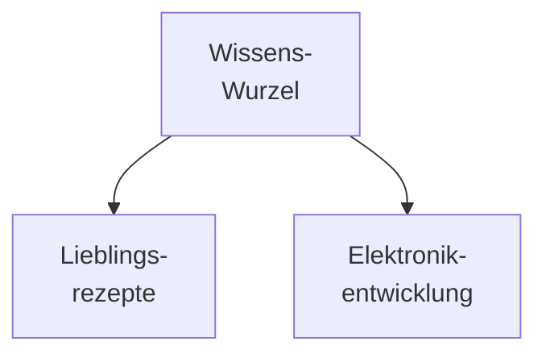
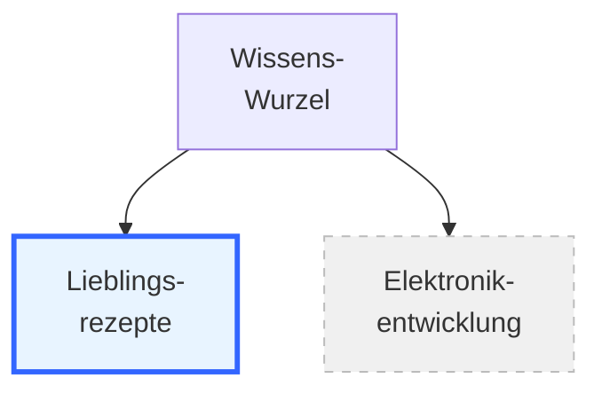
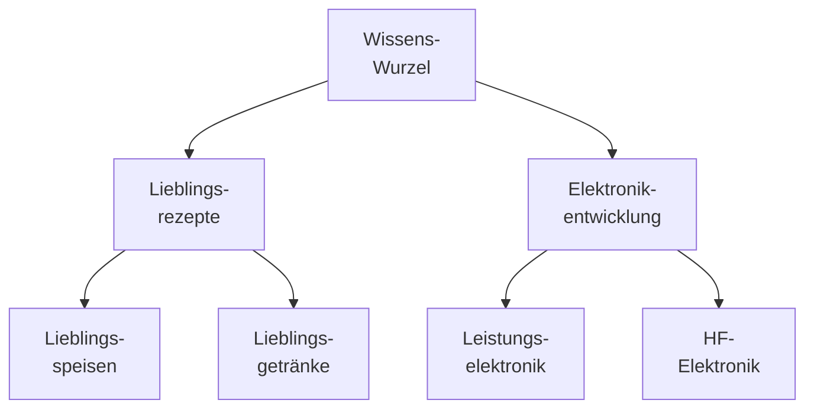
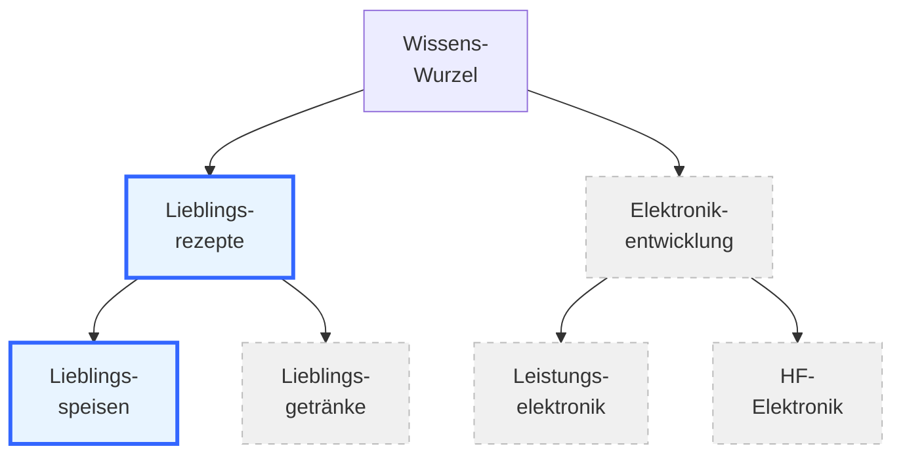

# Teil 2 — AI-Brain — Idee einer KI-Architektur

**Datum:** 2026-05-15
**Status:** Tutorial-Teil (2 von 4) — Architektur-Idee
**Lernziel:** Der Leser versteht die Grundidee des AI-Brains: Wissen ist in einer Baumstruktur organisiert, und der Kontext wird entsprechend dem Pfad im Baum aktiviert. Vokabular und technische Mechanismen bleiben Teil 3 vorbehalten.

## Wo wir stehen

In Teil 1 haben wir gelernt: Für jede KI-Anfrage gibt es einen *adäquaten* Kontext — passend und ausreichend, ohne Überschuss. Beide Extreme — zu wenig und zu viel — produzieren schlechte Antworten. Daraus ergibt sich eine praktische Frage:

> *Wie produziert man adäquaten Kontext?*

Wie entscheidet das KI-System, welches Wissen zu welcher Frage gehört — und welches besser draußen bleibt? In Teil 2 lernen wir einen ersten Antwort-Ansatz kennen: das **AI-Brain**. Wir betrachten zunächst nur das Prinzip — ohne Fachvokabular, ohne technische Mechanismen. Diese kommen erst in Teil 3.

## Ein konkretes Beispiel

Stellen wir uns einen Anwender vor, der ein KI-System für **zwei sehr unterschiedliche Bereiche** nutzen möchte:

- **Lieblingsrezepte** — eine über Jahre gewachsene persönliche Rezeptsammlung
- **Elektronikentwicklung** — Erfahrungswissen über tatsächlich eingesetzte Bauteile und gelungene Schaltungs-Designs

Beide Bereiche sind **persönlich und individuell**. Das vortrainierte Wissen, das in einem KI-Modell steckt, reicht für sie nicht aus: Lieblingsrezepte unterscheiden sich von Person zu Person, und Elektronikentwicklung lebt stark von der konkreten Erfahrung mit den bereits eingesetzten Bauteilen und Schaltungs-Mustern. Beide Bereiche brauchen also *zusätzliches*, individuelles Wissen, das dem KI-Modell als Kontext mitgegeben werden muss.

## Wissen als Baum

Die Idee des AI-Brains: **strukturiere dieses Wissen wie einen Baum**. An der Wurzel sitzt der gesamte Wissensvorrat, in den Ästen verzweigen sich die Themenbereiche, und in den Blättern liegt das konkrete Material.

So ergeben sich aus dem persönlichen Wissensvorrat zwei deutlich getrennte Äste — einer für jeden Themenbereich.

## Das Prinzip der Pfad-Aktivierung

Jetzt kommt der Kern des AI-Brain-Konzepts:

> *Bei einer Anfrage wird genau das Wissen aktiviert, das auf dem Pfad zur passenden Stelle im Baum liegt — alles andere bleibt unaktiviert.*

Konkret: Wenn der Anwender eine Frage zu Lieblingsrezepten stellt, dann *aktiviert* das KI-System nur den Rezepte-Ast und gibt dieses Wissen dem KI-Modell als Kontext mit. Der Elektronik-Ast bleibt draußen. Stellt er hingegen eine Frage zur Elektronikentwicklung, dann ist es umgekehrt:

*Anfrage zu Rezepten: der Rezepte-Ast ist aktiv (blau), der Elektronik-Ast bleibt inaktiv (grau, gestrichelt).*

## Warum funktioniert das?

Weil das Wissen über Elektronikbauteile bei einer Rezepte-Frage **wenig Qualitäts-Beitrag** leistet — und umgekehrt. Eine Frage nach einer Lasagne-Variation gewinnt nichts dadurch, dass im Kontext Datenblätter von Spannungsreglern stehen. Eine Frage zum Schaltplan einer Stromversorgung gewinnt nichts durch Apfelstrudel-Rezepte im Kontext.

Im Gegenteil: jedes Stück fremden Wissens, das mitgeschickt wird, **verdünnt** den Kontext (Erinnerung an Teil 1 — *Verdunkelung*). Indem wir den jeweils anderen Ast bewusst draußen lassen, halten wir den Kontext schlank und thematisch fokussiert. Er bleibt **adäquat**.

## Verfeinerung — der Baum wächst weiter

Bisher hatten wir nur zwei große Äste. In der Realität reicht das nicht aus: Lieblingsrezepte zerfallen in Speisen und Getränke, Elektronikentwicklung in Leistungselektronik und HF-Elektronik:

Auch auf dieser tieferen Ebene gilt das gleiche Prinzip: die Unterbereiche haben **wenig Überlappung**. Rezepte für Suppen helfen wenig beim Mixen eines Cocktails — Speisen und Getränke teilen das Thema *Esskultur*, aber die Substanz ist verschieden. Leistungselektronik (Spannungswandler, Motorsteuerungen) und HF-Elektronik (Antennen, Funkfilter) teilen das Thema *Schaltungs-Design*, aber die Auslegungs-Praxis ist sehr unterschiedlich.

Bei einer konkreten Anfrage — etwa nach einem Apfelstrudel — wird nicht nur der Rezepte-Ast aktiviert, sondern *innerhalb davon* auch nur der Speisen-Unterast:

Aktiviert wird der Pfad **Wurzel → Lieblingsrezepte → Lieblingsspeisen**. Alles andere bleibt unaktiviert. Der Kontext wird damit von Ebene zu Ebene **enger zugeschnitten** — adäquanter.

## Das Prinzip in einem Satz

> *Wissen wird hierarchisch in einem Baum organisiert. Bei einer Anfrage wandert das KI-System gedanklich von der Wurzel bis zur passenden Stelle, sammelt unterwegs alles Wissen entlang dieses Pfads ein, und ignoriert die nicht-passenden Seitenäste. Das Ergebnis: ein Kontext, der präzise auf die Anfrage zugeschnitten ist.*

## Warum das das Adäquanz-Problem löst

Die Verbindung zu Teil 1 ist jetzt direkt sichtbar — die drei Eigenschaften adäquaten Kontexts werden alle drei durch ein einziges strukturelles Prinzip erreicht:

| Adäquanz-Eigenschaft | Wie das AI-Brain sie erfüllt |
|---|---|
| **passend** | nur der relevante Pfad wird aktiviert |
| **ausreichend** | entlang des Pfads wird alles eingesammelt, was zum Thema gehört |
| **ohne Überschuss** | die nicht-passenden Seitenäste bleiben draußen |

Das ist die zentrale Leistung des AI-Brains: ein einfaches Struktur-Prinzip löst die Adäquanz-Aufgabe automatisch — sofern der Wissensbaum **vernünftig strukturiert** ist, also benachbarte Äste tatsächlich wenig Überlappung haben.

## Was du jetzt weißt

Am Ende von Teil 2 solltest du folgendes klar erkannt haben:

1. Das **AI-Brain** organisiert Wissen in einer **Baumstruktur**. Jeder Ast steht für einen Themenbereich; tiefer liegende Verzweigungen stehen für Unterbereiche mit zunehmender Spezialisierung.

2. **Pfad-Aktivierung:** bei einer Anfrage wird genau das Wissen entlang des Pfads zur passenden Stelle aktiviert. Alle anderen Äste bleiben unaktiviert.

3. Das Prinzip funktioniert, weil benachbarte Äste meist **wenig Überlappung** haben — Wissen aus einem fremden Bereich trägt zur aktuellen Frage kaum bei und würde nur Verdunkelung erzeugen.

4. **Adäquanz entsteht damit von selbst:** der aktivierte Kontext ist *passend und ausreichend, ohne Überschuss* — genau die Eigenschaften, die in Teil 1 als Ziel identifiziert wurden.

5. Das Prinzip skaliert **rekursiv**: auf jeder Tiefe des Baums gilt dasselbe Verfahren. Je tiefer der aktivierte Pfad, desto enger der Kontextzuschnitt.

## Ausblick auf Teil 3

Wir haben jetzt das **Prinzip** verstanden: Baum + Pfad-Aktivierung. Aber das Prinzip allein lässt noch viele Fragen offen:

- **Wo lebt der Wissensbaum?** Auf der Festplatte? In der Cloud? In einer Datenbank?
- **Was ist konkret ein "Ast"?** Ein Ordner? Ein Tag? Ein Verzeichnis-Pfad?
- **Wer aktiviert den Pfad?** Der Anwender manuell, oder das System automatisch?
- **Wie geschieht die Aktivierung technisch?** Wie kommt der Kontext zum KI-Modell?

In **Teil 3** beantworten wir diese Fragen konkret. Wir realisieren den Baum auf der eigenen Festplatte, richten die Knoten als spezielle Ordner ein, und konfigurieren einen kleinen Mechanismus, der bei jeder Anfrage den passenden Pfad **automatisch** aktiviert. Dort kommen dann auch die technischen Vokabeln zum Einsatz, die wir bisher bewusst vermieden haben.
