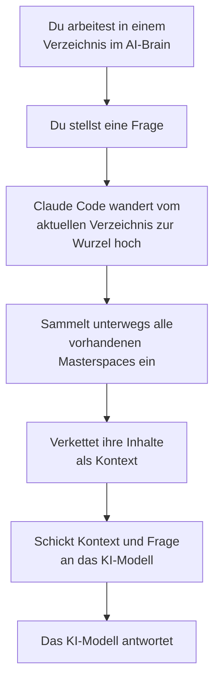

# Teil 3 (vereinfacht) — AI-Brain — Aufbau und Aktivierung

**Datum:** 2026-05-15
**Status:** Tutorial-Teil (3 von 4) — vereinfachte Umsetzung. Diese Fassung verzichtet auf eine eigene Namens-Konvention für Projekt-Folder; statt dessen markiert die schiere Anwesenheit eines `@`-Unterordners ein Verzeichnis als Baumknoten.
**Lernziel:** Der Leser kann ein eigenes minimal funktionierendes AI-Brain auf seinem System aufsetzen — mit zwei Namens-Konventionen, einer Masterspace-Struktur und einem Aktivierungs-Mechanismus, der bei jeder Anfrage automatisch den passenden Pfad einsammelt.

## Wo wir stehen

In **Teil 1** haben wir die *Adäquanz-Hypothese* kennengelernt: *zu wenig* und *zu viel* Kontext sind beide schlecht; gut ist nur, was *passend und ausreichend ohne Überschuss* ist.

In **Teil 2** haben wir das **AI-Brain** als Architektur-Idee vorgestellt: Wissen wird in einer Baumstruktur organisiert, und der Kontext wird **entsprechend dem Pfad** im Baum aktiviert. Wir haben das auf der Prinzip-Ebene betrachtet — *ohne* technische Vokabeln, *ohne* Mechanismus-Details.

In **Teil 3** wird das Prinzip konkret. Wir beantworten:

- Wo lebt der Wissensbaum?
- Wie sieht ein "Baumknoten" konkret aus?
- Wo liegt der aktivierbare Kontext?
- Wer aktiviert den Pfad — und wie?

## Das Dateisystem als Wissensbaum

Der einfachste Träger für einen Wissensbaum existiert auf jedem Computer bereits: **das Dateisystem**. Verzeichnisse und Unterverzeichnisse bilden eine natürliche Baumstruktur. Die Wurzel ist ein bestimmtes Verzeichnis; jedes Unterverzeichnis ist ein potenzieller Knoten.

Aber: **nicht jedes Verzeichnis** soll ein Baumknoten des AI-Brains sein. Manche Verzeichnisse enthalten Hilfsdaten, Caches, technische Beiwerke — die gehören nicht zum Wissensbaum. Wir brauchen also eine **Konvention**, mit der wir markieren, welche Verzeichnisse tatsächlich Knoten sind, und wo die aktivierbaren Inhalte liegen.

Es zeigt sich: **zwei einfache Konventionen reichen aus**.

## Zwei Konventionen — die ganze Mechanik

### 1. Baumknoten haben einen Masterspace

Diese Konvention trägt die ganze Mechanik:

> **Jeder Knoten des Wissensbaums ist ein Verzeichnis, das einen Masterspace enthält.**

Und ein **Masterspace** ist nichts anderes als ein Unterverzeichnis mit dem Namen `@`. Er enthält alle aktivierbaren Kontext-Dateien dieses Knotens.

Damit entfällt jede zusätzliche Namens-Konvention für die "Projekt-Folder". Die Namen der Verzeichnisse sind völlig frei wählbar — `Lieblingsrezepte`, `Elektronikentwicklung`, `MeinThema`, was immer du willst. Was zählt, ist allein, ob ein Masterspace darunter liegt.

**Vereinfachte Aktivierungs-Regel:**

> Sobald ein Verzeichnis (mit Masterspace) auf dem aktivierten Pfad liegt, wird der **gesamte Inhalt seines Masterspaces** als Kontext dem KI-Modell mitgegeben.

Verzeichnisse **ohne** Masterspace gehören schlicht nicht zum Wissensbaum. Sie können beliebige Inhalte enthalten (Bilder, Tabellen, Skripte, temporäre Daten) — sie werden bei der Aktivierung **vollständig ignoriert**.

### 2.  Wurzel eines AI-Brains

Die Wurzel eines AI-Brains ist ein Verzeichnis, dessen Name mit dem Sonderzeichen `§` beginnt:

```
§Privat/
```

Sobald Claude Code (oder ein anderes KI-System) auf ein solches Verzeichnis stößt, weiß es: *Hier beginnt ein AI-Brain.* Der Name dahinter (*Privat*, *Firma*, *Forschung*, etc.) ist frei wählbar — er beschreibt nur, *welches* AI-Brain das ist.

**Pflicht:** Die Wurzel muss einen Masterspace (@-Unterordner) haben. Damit ist sie selbst der oberste Baumknoten und kann allgemeinen Kontext beisteuern, der für alle darunter liegenden Anfragen gilt.

## Ein konkretes Beispiel-Setup

Setzen wir das Lieblingsrezepte/Elektronik-Beispiel aus Teil 2 als Dateisystem-Baum um:

```
§Privat/                                  ← Wurzel (mit §, Pflicht-Masterspace)
├── @/
│   └── persoenliche-allgemein.md         ← gilt für alle Anfragen
├── Lieblingsrezepte/                     ← Baumknoten (hat @/)
│   ├── @/
│   │   └── rezept-vorlieben.md
│   ├── Lieblingsspeisen/                 ← Baumknoten (hat @/)
│   │   └── @/
│   │       └── speisen-praeferenzen.md
│   └── Lieblingsgetränke/                ← Baumknoten (hat @/)
│       └── @/
│           └── getraenke-vorlieben.md
├── Elektronikentwicklung/                ← Baumknoten (hat @/)
│   ├── @/
│   │   └── bauteil-bestand.md
│   ├── Leistungselektronik/              ← Baumknoten (hat @/)
│   │   └── @/
│   │       └── leistungsdesign-notizen.md
│   └── HF-Elektronik/                    ← Baumknoten (hat @/)
│       └── @/
│           └── hf-design-notizen.md
└── caches/                               ← kein @/ → kein Baumknoten
    └── (technische Hilfsdaten)
```

Beachte die letzte Zeile: `caches/` ist ein gewöhnliches Verzeichnis ohne `@`-Unterordner. Es liegt unter der Wurzel, ist aber **kein Baumknoten** und wird bei jeder Aktivierung ignoriert. So können Hilfsverzeichnisse problemlos neben den Wissens-Knoten koexistieren.

Jeder Baumknoten hat **seinen eigenen Masterspace** (`@/`). Die Inhalte sind thematisch zugeschnitten:

- `persoenliche-allgemein.md` (Wurzel-Masterspace) — Dinge, die *überall* gelten: Anrede, Sprachpräferenz, allgemeine Stil-Vorgaben
- `rezept-vorlieben.md` (Rezepte-Masterspace) — Geschmacksvorlieben, Allergien, Familienregeln
- `speisen-praeferenzen.md` (Speisen-Unterast) — speisenspezifisch: bevorzugte Garmethoden, Lieblingszutaten
- `getraenke-vorlieben.md` (Getränke-Unterast) — Lieblings-Cocktails, alkoholfreie Varianten, bevorzugte Tees
- `bauteil-bestand.md` (Elektronik-Masterspace) — Inventar an Bauelementen, bevorzugte Hersteller
- `leistungsdesign-notizen.md` (Leistungselektronik-Unterast) — bewährte Schaltungs-Muster für Spannungs- und Stromversorgung
- `hf-design-notizen.md` (HF-Elektronik-Unterast) — Topologien für Filter und Antennen-Anpassungen, EMV-Erfahrungen

## Wer aktiviert? — Claude Code mit einem Hook

Bisher ist alles statisch: ein Baum aus Verzeichnissen, in jedem Knoten ein Masterspace. Aber wer **aktiviert** den Pfad bei einer konkreten Anfrage?

Das ist Aufgabe des KI-Systems. Wir verwenden **Claude Code** (Anthropics CLI-Werkzeug für Programmier-Aufgaben) als konkrete Plattform. Claude Code bietet einen **Hook-Mechanismus**: ein kleines Skript, das bei jedem Prompt automatisch ausgeführt wird, *bevor* das KI-Modell die Anfrage erhält.

Wir konfigurieren diesen Hook so, dass er bei jedem Prompt das Folgende macht:



Der entscheidende Schritt ist die **Aufwärts-Wanderung** von der aktuellen Arbeitsposition (das *current working directory*, *cwd*) zur Wurzel des AI-Brains. Auf jeder Ebene wird geprüft: *"Gibt es hier ein @-Unterverzeichnis?"* — wenn ja, wird sein Inhalt eingesammelt. Wenn nein, wird die Ebene übersprungen. So wirkt die Konvention 2 als automatischer Filter: nur echte Baumknoten tragen bei, alle anderen Verzeichnisse fließen unbeachtet vorbei.

Masterspaces in **Seitenästen** werden ebenfalls ignoriert — denn die Wanderung berührt sie nicht. Genau das ist die in Teil 2 beschriebene Pfad-Aktivierung.

## Probelauf — was passiert konkret?

Stell dir vor, du arbeitest in deinem AI-Brain an einem Apfelstrudel-Rezept. Du wechselst in das entsprechende Verzeichnis:

```
cd §Privat/Lieblingsrezepte/Lieblingsspeisen/
```

Dort startest du Claude Code und stellst die Frage:

> *"Schlag mir eine Apfelstrudel-Variation mit weniger Zucker vor."*

Bevor dein KI-Modell die Frage erhält, läuft der Hook. Er wandert auf:

```
Lieblingsspeisen     ←  Start (cwd)
        ↑
Lieblingsrezepte
        ↑
§Privat               ←  Wurzel, fertig
```

Und sammelt auf jeder Ebene den Masterspace-Inhalt ein:

1. `Lieblingsspeisen/@/speisen-praeferenzen.md`
2. `Lieblingsrezepte/@/rezept-vorlieben.md`
3. `§Privat/@/persoenliche-allgemein.md`

Alle drei Dateien werden als Kontext ans KI-Modell mitgeschickt. Die Elektronik-Inhalte werden **nicht** mitgeschickt — sie liegen außerhalb des aktivierten Pfads. Das `caches/`-Verzeichnis wird ebenfalls nicht berührt — es liegt zwar unter der Wurzel, hat aber keinen Masterspace.

Das KI-Modell antwortet mit Wissen, das *speisen-spezifisch*, *rezeptphilosophie-konsistent* und an deine *persönlichen Vorgaben* angepasst ist. Genau das ist adäquater Kontext im Sinn von Teil 1.

## Setup-Schritte für den eigenen AI-Brain

Wenn du selbst ein AI-Brain aufsetzen möchtest, brauchst du im Wesentlichen drei Dinge:

1. **Claude Code installiert** und mit einem Anthropic-Account verbunden.

2. **Den AI-Brain-Baum als Verzeichnisse anlegen** — die §-Wurzel (mit Pflicht-Masterspace), beliebig viele Themen-Verzeichnisse darunter (jeweils mit @-Unterordner, wenn sie Wissen beisteuern sollen), und in jeden Masterspace deine `.md`-Dateien.

3. **Den Hook registrieren** — der Befehl `ai-brain --setup` trägt den Hook **idempotent** in deine globale Claude-Code-Konfiguration `~/.claude/settings.json` ein (per `jq`-Merge, sodass andere Top-Level-Keys wie `"theme"` erhalten bleiben). Ab sofort ruft Claude Code bei *jeder* Anfrage `ai-brain --context` auf; das Hook-Skript prüft selbstständig, ob das aktuelle Verzeichnis innerhalb eines AI-Brains (also unterhalb einer `§`-Wurzel mit `@`-Unterordnern auf dem Pfad) liegt und liefert nur dann Kontext — sonst läuft es still durch.

Den genauen Skript- und JSON-Inhalt sowie eine vollständige Schritt-für-Schritt-Anleitung — vom Anlegen der Verzeichnisstruktur bis zur ersten lauffähigen Anfrage — findest du in **Teil 4** dieses Tutorials.

## Was du jetzt kannst

Am Ende von Teil 3 solltest du folgendes klar erkannt haben — und idealerweise auch *anwenden können*:

1. Das **Dateisystem** dient als Träger des Wissensbaums. Verzeichnisse bilden Knoten und Äste.

2. **Zwei Konventionen** definieren die Struktur:
   - `§` markiert die Wurzel des AI-Brains, die einen Pflicht-Masterspace haben muss
   - Jedes Verzeichnis mit `@`-Unterordner ist ein Baumknoten; der `@`-Ordner enthält die aktivierbaren Kontext-Dateien
   - Verzeichnisse ohne `@/` sind keine Baumknoten und werden ignoriert

3. **Verzeichnisnamen sind frei wählbar** — es gibt keine zusätzliche Kürzel- oder Präfix-Pflicht. Was ein Verzeichnis zum Knoten macht, ist allein die Anwesenheit eines `@`-Unterordners.

4. **Aktivierung** ist eine **Aufwärts-Wanderung** vom aktuellen Arbeits-Verzeichnis bis zur Wurzel. Auf jeder Ebene wird der Masterspace-Inhalt eingesammelt — *wenn vorhanden* — und als Kontext dem KI-Modell mitgegeben.

5. Seitenäste, die nicht auf dem aktivierten Pfad liegen, sowie Verzeichnisse ohne `@/`, werden **automatisch ignoriert** — damit ist die Pfad-Aktivierung aus Teil 2 mechanisch umgesetzt.

6. Du kannst ein eigenes, minimal funktionierendes AI-Brain aufsetzen: Verzeichnisse anlegen, @-Unterordner als Masterspace darin, `.md`-Dateien einfügen, Hook konfigurieren — fertig.

## Ausblick — was hier nicht behandelt wurde

Das AI-Brain-Konzept hat noch einige Tiefen, die wir bewusst nicht in dieses Tutorial aufgenommen haben:

- **Verschachtelte AI-Brains** — innerhalb eines AI-Brains kann ein weiteres `§`-Verzeichnis auftauchen. Damit lassen sich AI-Brains *komponieren*, wobei das Eltern-Brain seine Konventionen an das Kind-Brain vererbt.

- **Feinere Masterspace-Struktur** — in der Praxis unterteilt man den Masterspace häufig in mehrere Klassen (z. B. *Regeln*, *Kontext-Dateien*, *Memos*, *Hypothesen*, *Tutorials*). Das macht das Wissens-Management bei wachsenden Brains übersichtlicher.

- **Hilbertraum-Sicht** — die Adäquanz-Hypothese lässt sich auch mathematisch fassen, als Projektions-Geometrie im Embedding-Raum des KI-Modells. Für tiefere theoretische Einblicke siehe die Memo-Reihe im Projekt-Ordner.

- **Empirische Validierung** — das AI-Brain-Konzept ist eine begründete Hypothese, kein bewiesener Befund. Wer es ernsthaft einsetzen möchte, sollte den eigenen Adäquanz-Gewinn an konkreten Aufgaben messen.

Aber das alles braucht es nicht, um zu starten. Mit den zwei Konventionen aus diesem Teil hast du das **minimale, vollständige Modell** in der Hand. Bau dir einen eigenen Wissensbaum, fülle die ersten Masterspaces, und probiere aus, wie sich deine KI-Anfragen verändern, wenn der Kontext plötzlich *passend und ausreichend, ohne Überschuss* ist.

Viel Erfolg.
